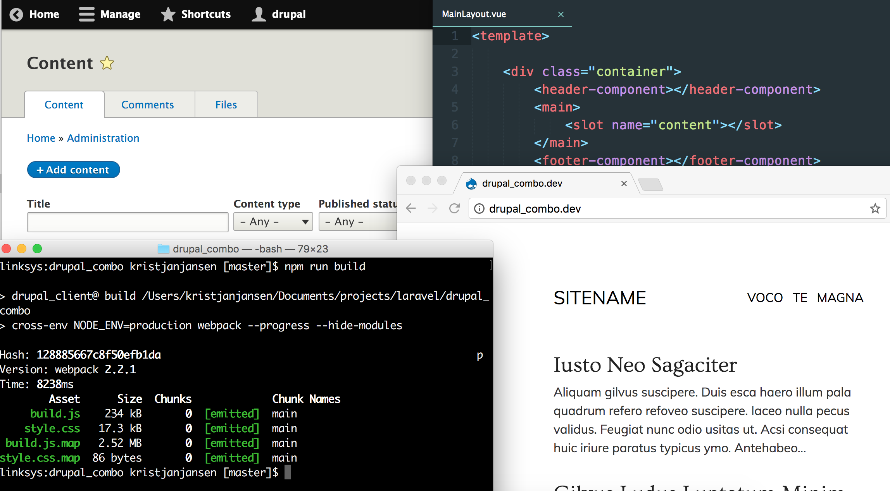

## A modern Drupal 8 development stack

### Requirements

* LAMP stack ([Laragon](https://laragon.org/) on Windows or [Laravel Valet](https://laravel.com/docs/valet) on OSX)
* Composer
* Git
* NodeJS and optionally [Yarn](https://yarnpkg.com/en/docs/install) 

### Installation

```sh

# Server

git clone https://github.com/kristjanjansen/drupal_combo drupal
cd drupal
composer install
./vendor/bin/drupal site:install -n --db-name=drupal --db-user=root --site-name=drupal --site-mail=drupal@drupal.com --account-name=drupal --account-mail=drupal@drupal.com --account-pass=drupal --force standard
./vendor/bin/drush config-import --partial --source="config/sync/" -y
./vendor/bin/drupal module:install jsonapi
./vendor/bin/drupal module:install example
./vendor/bin/drupal theme:install example_js1 --set-default
./vendor/bin/drupal theme:install example_js2
./vendor/bin/drupal theme:install example_vue
./vendor/bin/drupal theme:install example_react
./vendor/bin/drupal create:nodes article --limit=3 --title-words=1 --time-range=5
./vendor/bin/drupal create:comments 1 --limit=3 --title-words=1 --time-range=5
./vendor/bin/drupal create:comments 2 --limit=3 --title-words=1 --time-range=5
./vendor/bin/drupal create:comments 3 --limit=3 --title-words=1 --time-range=5

# Client

yarn # or npm install
npm run build

# If you have Valet installed then

valet open
```

```sh
# ./vendor/bin/drupal config:export:single --name=user.role.anonymous --remove-uuid --remove-config-hash --directory="config/sync"

# Downsides

accessibility
translations / t
formatters
```